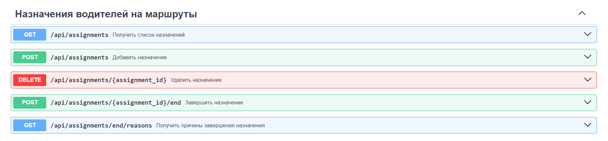
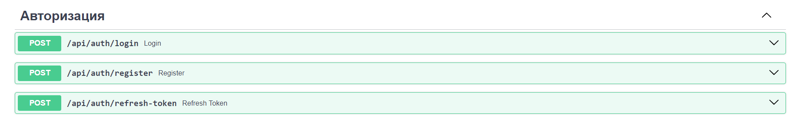

### Водители

###### `GET /api/drivers` - Получить список водителей
###### `POST /api/drivers` - Добавить водителя
###### `DELETE /api/drivers/{driver_id}` - Удалить водителя

###### `GET /api/drivers/classes` - Получить список классов водителей
###### `POST /api/drivers/classes` - Добавить класс водителя
###### `DELETE /api/drivers/classes/{driver_class_id}` - Удалить класс водителя

###### `GET /api/drivers/{driver_id}/work_schedule` - Получить график работы водителя
###### `GET /api/drivers/classes/count` - Получить количество водителей в каждом классе

### Маршруты  
  

###### `GET /api/routes` - Получить список маршрутов  
###### `POST /api/routes` - Добавить маршрут  
###### `DELETE /api/routes/{route_id}` - Удалить маршрут  
###### `GET /api/routes/schedules` - Получить расписание для каждого маршрута  
###### `GET /api/routes/total-length` - Получить общую длину всех маршрутов  

### Автобусы  
  

###### `GET /api/buses` - Получить список автобусов  
###### `POST /api/buses` - Добавить автобус  
###### `DELETE /api/buses/{bus_id}` - Удалить автобус  
###### `POST /api/buses/types` - Добавить тип автобуса  
###### `GET /api/buses/types` - Получить список типов автобусов  
###### `DELETE /api/buses/types/{bus_type_id}` - Удалить тип автобуса  

### Назначения водителей на маршруты  
  

###### `GET /api/assignments` - Получить список назначений  
###### `POST /api/assignments` - Добавить назначение  
###### `DELETE /api/assignments/{assignment_id}` - Удалить назначение  
###### `POST /api/assignments/{assignment_id}/end` - Завершить назначение  
###### `GET /api/assignments/end/reasons` - Получить причины завершения назначения  

### Авторизация  
  

###### `POST /api/auth/login` - Авторизоваться  
###### `POST /api/auth/register` - Зарегистрироваться
###### `POST /api/auth/refresh-token` - Обновить токен доступа  
